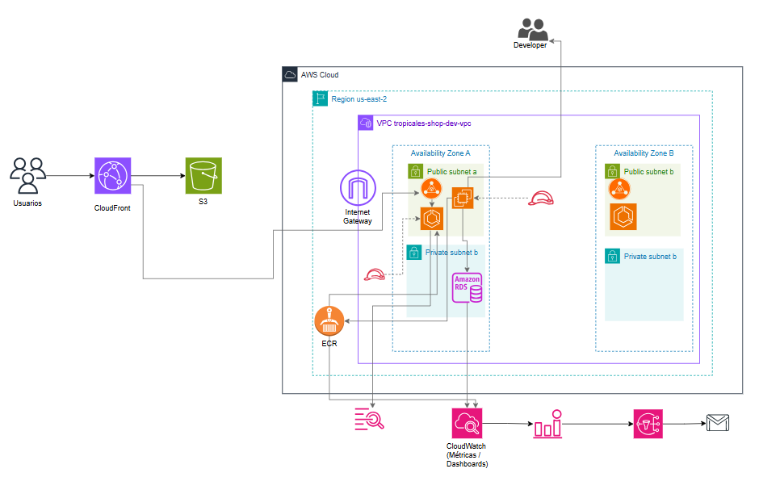
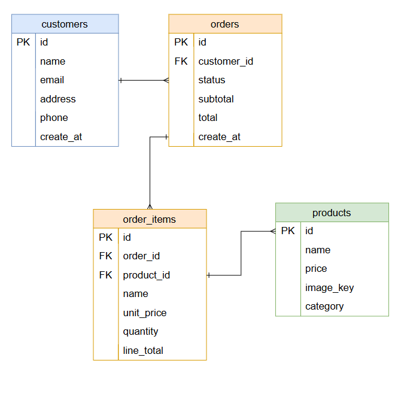

# Arquitectura – tropicales-shop (entorno dev)

## 1. Descripción general del proyecto

El proyecto tropicales-shop implementa una arquitectura web de tres capas en AWS para una tienda online simple:

- **Frontend**: SPA en Angular servida desde **Amazon S3** detrás de **Amazon CloudFront** (HTTPS).
- **Backend**: API REST en **Node.js/Express**, ejecutándose en **ECS Fargate** detrás de un Application Load Balancer (ALB).
- **Base de datos**: **Amazon RDS MySQL** en subred privada.

El objetivo principal del reto es demostrar:

- Diseño de red seguro (**VPC, subnets, Security Groups**).
- Despliegue de compute en **EC2** y posterior migración a contenedores (**ECS Fargate**).
- Uso de servicios gestionados (**RDS, CloudFront, ECS, ECR**).
- Monitoreo, alarmas y buenas prácticas de **seguridad / IAM**.

---

## 2. Arquitectura general

### 2.1 Diagrama lógico



#### Capa de presentación

- Flujo principal:
  - Usuario → Internet → CloudFront → S3 (frontend Angular).
  - El frontend Angular, ya desplegado en S3, consume la API usando el mismo dominio de CloudFront:
    `https://d25ywqiyuq14r9.cloudfront.net/api/...`
  - CloudFront tiene un behavior `/api/*` que enruta esas peticiones hacia el ALB
    `tropicales-shop-dev-alb-2003296475.us-east-2.elb.amazonaws.com`.

#### Capa de aplicación

- **Application Load Balancer (ALB)** público en subredes públicas.
- **ECS Fargate Service**:
  - Imagen almacenada en **ECR**.
  - API Node.js/Express exponiendo endpoints como:
    - `/health`
    - `/api/products`
    - `/api/orders`

#### Capa de datos

- **RDS MySQL** en subredes privadas.
- El Security Group de RDS **solo permite tráfico** desde el SG de la capa app (ECS).

#### Acceso de administración

- **EC2 pública (bastion)** en subred pública:

  - Acceso SSH desde IP personal.
  - Usada para túnel SSH hacia RDS y pruebas internas.

- **Túnel SSH**:
  - `localhost:3307 → RDS:3306`
  - El cliente local (DBeaver) se conecta a `127.0.0.1:3307`.

---

## 3. Red y seguridad

### 3.1 VPC y subredes

- **VPC**: `tropicales-shop-dev-vpc`.
- **Subredes públicas**:
  - Alojan el **ALB** **ECS Fargate** (backend) y la **EC2 bastion**.
- **Subredes privadas**:
  
  - Alojan **RDS MySQL** (base de datos).
- **Internet Gateway**:
  - Asociado a la VPC para tráfico de Internet desde/hacia subnets públicas.
- **Route Tables**:
  - **Públicas**: envía todo el tráfico de salida (0.0.0.0/0) hacia el Internet Gateway (IGW), permitiendo acceso a internet a las subnets asociadas.
  - **Privadas**: ruta 10.0.0.0/16 local, sin 0.0.0.0/0, usada por las subnets privadas sin acceso directo a internet.

### 3.2 Security Groups

- **ALB – `tropicales-shop-dev-sg-alb`**

  - **Inbound**:
    - HTTP (TCP 80) desde `0.0.0.0/0`.
      - Cualquier cliente de Internet puede acceder al ALB por HTTP.
  - **Outbound**:
    - `All traffic` hacia `0.0.0.0/0`.
      - Permite al ALB reenviar tráfico hacia los targets (ECS/EC2 backend) según el Target Group.

- **App ECS – `tropicales-shop-dev-sgr-ecs-app`**

  - **Inbound**:
    - Custom TCP **8080** solo desde el SG del ALB (`tropicales-shop-dev-sg-alb`).
      - Las tareas ECS **no son accesibles directamente desde Internet**, solo a través del ALB.
  - **Outbound**:
    - `All traffic` hacia `0.0.0.0/0`.
      - Permite tráfico saliente hacia RDS (según reglas del SG de RDS), ECR, CloudWatch Logs/Metrics y otros servicios de AWS que necesite la app.

- **App EC2 – `tropicales-shop-dev-ecs-sg`**

  - **Inbound**:
    - Custom TCP **8080** desde `tropicales-shop-dev-sg-alb`.
      - El backend EC2 solo recibe tráfico de aplicación desde el ALB.
    - SSH (TCP 22) desde `191.97.15.107/32`.
      - Acceso administrativo controlado desde una IP concreta (para administración/bastion).
  - **Outbound**:
    - `All traffic` hacia `0.0.0.0/0`.
      - Permite conexiones salientes hacia RDS y otros servicios externos/AWS.

- **RDS – `tropicales-shop-dev-sg-rds`**
  - **Inbound**:
    - TCP **3306 (MySQL)** solo desde los SG autorizados (por ejemplo `tropicales-shop-dev-sgr-ecs-app` y/o `tropicales-shop-dev-ecs-sg`, y opcionalmente el SG de bastion si aplica).
      - La base de datos solo acepta conexiones desde la capa de aplicación / bastion autorizados.
  - **Outbound**:
    - `All traffic` (por defecto) hacia `0.0.0.0/0`.
      - Permite conexiones salientes si fueran necesarias (parches, telemetría, etc.).
  - **Acceso directo desde Internet**:
    - **No permitido** (no hay reglas desde `0.0.0.0/0` ni asociación con un ALB público).

### 3.3 Patrón de acceso a base de datos

- **RDS no es público**
- Acceso de desarrollo:
  - EC2 pública como **bastion**.
  - Túnel SSH hacia RDS.
  - Usuario limitado `dev_user` con permisos sobre `tienda.*` (base de datos).

**Justificación:**

- Mantener RDS aislada en subred privada.
- Accesos de administración controlados por **SSH + IAM + key pair**.

---

## 4. Backend / Compute

### 4.1 Evolución EC2 → Fargate

#### Fase inicial (EC2)

- Backend Node.js desplegado en **EC2**:
  - SO: **Amazon Linux 2023**.
  - Código en: `/opt/tropicales-shop/app`.
  - Proceso gestionado con **pm2** escuchando en puerto 8080.
  - El ALB apuntaba a esta instancia mediante un **Target Group tipo instance**.

#### Fase final (ECS Fargate)

- El backend se **dockeriza** y se migra a **ECS Fargate**:
  - La EC2 queda solo como **bastion / host de administración**.
  - El ALB ahora apunta a un **Target Group IP** donde se registran las tasks Fargate.

> Historia de evolución:
> “La capa de aplicación evolucionó de un servidor EC2 tradicional a una solución basada en contenedores con ECS Fargate, manteniendo la misma VPC, ALB y RDS.”

### 4.2 Contenedores y ECR

**Dockerfile backend (resumen):**

- Base: `node:20-alpine`.
- `WORKDIR /opt/tropicales-shop/app`.
- `COPY package*.json` + `npm ci --only=production`.
- `COPY . .`
- `EXPOSE 8080`
- `CMD ["node", "index.js"]`

**Amazon ECR:**

- Repositorio: `tropicales-shop-dev-ecr-backend`.
- Tag de imagen: `:dev`.

**Uso de EC2 en el flujo de build:**

- La EC2 se usó para:
  - Construir la imagen Docker.
  - Autenticarse en ECR (`aws ecr get-login-password`).
  - Pushear la imagen al repositorio ECR.

### 4.3 ECS Fargate

**Cluster**

- `tropicales-shop-dev-ecs-cluster` (solo Fargate).

**Task Definition**

- Nombre: `tropicales-shop-dev-ecs-td-backend`.
- Launch type: `FARGATE`.
- CPU / Memoria: `0.5 vCPU / 1 GB`.
- Network mode: `awsvpc`.

**Contenedor**

- Nombre: `tropicales-shop-backend`.
- Imagen: `.../tropicales-shop-dev-ecr-backend:dev` (ECR).
- Puerto contenedor: `8080`.
- Variables de entorno típicas:
  - `PORT=8080`
  - `DB_HOST`
  - `DB_PORT`
  - `DB_USER`
  - `DB_PASS`
  - `DB_NAME`
- Logs:
  - Driver `awslogs` a log group:
    - `/ecs/tropicales-shop-dev-ecs-td-backend`.

**Service ECS**

- Nombre: `tropicales-shop-dev-ecs-service-backend`.
- Tipo: Fargate, `awsvpc`.
- Subnets: privadas.
- SG: `tropicales-shop-dev-sgr-ecs-app`.
- Integrado con ALB mediante **Target Group IP**.
- Health check: endpoint `/health`.

**Auto Scaling del Service**

- Policy: `tropicales-shop-dev-ecs-cpu-scaling`.
- Tipo: **Target Tracking**.
- Métrica: `ECSServiceAverageCPUUtilization`.
- Target: `70%`.

Valores de capacidad (modo demo / ahorro):

- `min = 0`
- `desired = 0` cuando no se está presentando para minimizar costos.
- Para demo/presentación: se ajusta `desired = 1`.

---

## 5. Base de datos – RDS MySQL

- Instancia: `tropicales-shop-dev-rds`.
- Engine: **MySQL 8.0.42**.
- Clase: `db.t4g.micro`.
- Subnet group privado: `tropicales-shop-dev-db-subnet-group`.

### 5.1 Esquema `tienda`

El esquema `tienda` modela una tienda en línea sencilla que permite gestionar productos, clientes y órdenes de compra.



- **Tabla `products`**  
  Contiene el catálogo de productos disponibles en la tienda.

  - `id`: identificador único del producto.
  - `name`: nombre del producto.
  - `price`: precio unitario.
  - `image_key`: ruta o clave de la imagen del producto (por ejemplo, en un bucket de almacenamiento).
  - `category`: categoría del producto (por ejemplo: _Sustrato_, _Fertilizante_, _Macetas_, _Herramientas_).

- **Tabla `customers`**  
  Almacena los datos de los clientes.

  - Datos principales: nombre, correo electrónico, dirección y teléfono.
  - Se utiliza para asociar cada orden a un cliente específico.

- **Tabla `orders`**  
  Representa el encabezado de cada orden de compra.

  - Referencia a un cliente (`customer_id`).
  - Estado de la orden (por ejemplo: `PENDING`, `PAID`, `CANCELLED`).
  - Montos de la orden: `subtotal`, `tax`, `total`.
  - Fecha de creación de la orden.

- **Tabla `order_items`**  
  Contiene el detalle de los productos incluidos en cada orden.
  - Referencia a la orden (`order_id`) y al producto (`product_id`).
  - Nombre del producto en el momento de la compra.
  - Precio unitario, cantidad y total por línea.

Estas tablas soportan el flujo básico de órdenes de compra: un cliente (`customers`) realiza una orden (`orders`) que contiene uno o varios productos (`products`), registrados en el detalle de la orden (`order_items`).

### 5.2 Conexión desde backend

Variables `.env`:

```env
DB_HOST=tropicales-shop-dev-rds.ch2s8smos70f.us-east-2.rds.amazonaws.com
DB_PORT=3306
DB_USER=admin
DB_PASS=********
DB_NAME=tienda
```

### 5.3 Backups y snapshots

- **Automated backups**:
  - Habilitados.
  - Retention: 7 días.
- **Manual snapshot**:
  - `tropicales-shop-dev-rds-snap-YYYYMMDD`.
  - Uso: backup puntual antes de cambios importantes y como evidencia del reto.
  - Se tiene un snapshot inicial que contiene datos de prueba `tropicales-shop-dev-rds-initial`

> **Justificación**:
> “Con automated backups y al menos un snapshot manual, puedo hacer point-in-time recovery de la base de datos dev y tengo un respaldo explícito antes de cambios.”

---

## 6. Frontend – S3 + CloudFront

### 6.1 S3

- **Bucket**: `tropicales-shop-dev-s3-frontend`.
- **Uso**:
  - Hosting de la app Angular (`dist/frontend/browser`).
  - También aloja las imágenes de productos en `assets/products/....`
- **Nota**: En un entorno productivo se podría separar:
  - Un bucket para frontend.
  - Un bucket para imágenes de productos con subida automática (implementando en la app un módulo para creación de productos).
    En dev se mantienen juntos por simplicidad y costo mínimo.

### 6.2 CloudFront

- **Distribución**

  - Nombre lógico: `tropicales-shop-dev-cf-frontend`.
  - Domain: `https://d25ywqiyuq14r9.cloudfront.net`.
  - Función principal: punto de entrada único para el **frontend Angular y la API**.

- **Origins configurados**

  1. **Origin S3 – Frontend**
     - `tropicales-shop-dev-s3-frontend.s3.us-east-2.amazonaws.com`
     - Uso: servir la SPA Angular (HTML, JS, CSS, assets).
  2. **Origin ALB – Backend**
     - `tropicales-shop-dev-alb-2003296475.us-east-2.elb.amazonaws.com`
     - Uso: recibir el tráfico `/api/*` desde CloudFront y distribuirlo a las tareas ECS Fargate.

- **Behaviors (comportamientos)**

  - **Default behavior**

    - Path pattern: `*`
    - Origin: S3 (`tropicales-shop-dev-s3-frontend`)
    - Sirve la aplicación Angular.

  - **Behavior API**
    - Path pattern: `/api/*`
    - Origin: ALB (`tropicales-shop-dev-alb-2003296475.us-east-2.elb.amazonaws.com`)
    - Viewer protocol policy: **Redirect HTTP to HTTPS**
    - Cache policy: `Managed-CachingDisabled` (no se cachea la API).
    - Origin request policy: `Managed-AllViewer` (reenvía headers, query params, etc. necesarios a la API).

- **Política de protocolo**
  - El usuario siempre entra por **HTTPS** a CloudFront.
  - CloudFront termina TLS y se comunica con S3/ALB internamente por HTTP.
  - De esta forma, todo el tráfico entre cliente y punto de entrada está cifrado.
- **Flujo de deploy frontend (CLI)**:

```bash
ng build --configuration production
./deploy-tropicales.sh
```

## 7. Seguridad: IAM y acceso

### 7.1 IAM Roles principales

- **Roles de IAM Identity Center**
  - **`AWSReservedSSO_tropicales-shop-Ps-admin_*`**: Permiso: **AdministratorAccess**. Uso: administración total de la cuenta (solo para _owner_).
  - **`AWSReservedSSO_tropicales-shop-Ps-devs_*`**: Permiso: **AIOpsReadOnlyAccess**. Uso: perfiles de desarrollador / observador (lectura de recursos, sin cambios).
- **EC2 Instance Role**
  - **Nombre**: `tropicales-shop-dev-app-ec2-role`.
  - **Entidad de confianza**: `ec2.amazonaws.com`.
  - **Políticas (ejemplo)**: `AmazonEC2ContainerRegistryPowerUser` → pull/push a ECR.
  - **Beneficio**: La instancia EC2 se autentica contra ECR sin guardar _access keys_ en disco.
- **ECS Task Execution Role**
  - **Nombre**: `tropicales-shop-dev-ecs-task-exec-role`.
  - **Entidad de confianza**: `ecs-tasks.amazonaws.com`.
  - **Política**: `AmazonECSTaskExecutionRolePolicy`.
  - **Uso**:
    - Descargar imágenes desde ECR.
    - Enviar logs a CloudWatch Logs.
    - Evitar credenciales dentro del contenedor.

### 7.2 Usuarios IAM y MFA

- **Cuenta root**: **MFA habilitado**. No se usa para trabajo diario.
- **Acceso operativo**: A través de **IAM Identity Center** con grupos:
  - `tropicales-shop-developers`.
  - `tropicales-shop-administrators`.

---

## 8. Monitoreo y alertas

### 8.1 CloudWatch Dashboards

- **Dashboard**: `tropicales-shop-dev-dashboard`.
- **Widgets principales**:
  - **`CPUUtilization`** – ECS Service Backend.
  - **`HTTPCode_Target_5XX_Count`** + **`RequestCount`** – Target Group del ALB.
  - **`FreeStorageSpace`** – RDS MySQL.
- **Propósito**:
  - Ver comportamiento del backend bajo carga.
  - Detectar errores 5xx en la capa de aplicación.
  - Monitorear espacio disponible en RDS.

### 8.2 Alarmas CloudWatch + SNS

- **Topic SNS**: `tropicales-shop-dev-sns-alerts`.
- **Suscripción**: correo `judithcastro063@gmail.com`.
- **Alarmas configuradas**:
  - **`tropicales-shop-dev-ecs-cpu-high`**
    - Métrica: `ECSServiceAverageCPUUtilization`.
    - Condición: $\ge$ **70%** durante 5 minutos.
    - Acción: notificación al topic SNS. (La misma métrica se usa en la política de Auto Scaling del servicio ECS).
  - **`tropicales-shop-dev-alb-5xx-errors`**
    - Métrica: `HTTPCode_ELB_5XX_Count` del ALB.
    - Condición: $\ge$ **1** en una ventana de 5 minutos.
    - Acción: notificación al topic SNS.
- **Uso**: Detectar errores de infraestructura y aplicación, y dar visibilidad temprana sobre problemas en backend o RDS.

## 9. Anexo –  AWS Well-Architected aplicado a tropicales-shop

### 9.1 Operational Excellence (Excelencia Operacional)

|                                                                                                                                                                                                                               |
| ----------------------------------------------------------------------------------------------------------------------------------------------------------------------------------------------------------------------------- |
|  **Flujo de despliegue documentado**, el frontend se buildéa con un script y el backend se empaqueta en Docker, se sube a ECR y se actualiza la Task Definition y el Service de ECS Fargate.                       |
| **Separación de entornos**, todo se trabajó para un entorno `dev` y los recursos siguen el prefijo `tropicales-shop-dev-*`. En una siguiente fase se podría replicar la misma arquitectura para `qa` y `prod`.        |
| **Se monitorean métricas clave**, se creo un dashboard en CloudWatch con CPU de ECS, errores 5xx del ALB y la métrica `FreeStorageSpace` de RDS.                                                                           |

| **Alarmas y notificaciones configuradas**, se monitorea CPU alta en ECS y errores 5xx en el ALB, y las alarmas notifican al topic SNS `tropicales-shop-dev-sns-alerts`, en la actualidad un suscriptor.                         |
| **Guía básica de troubleshooting**, se documentó qué revisar ante errores 503 en el ALB, cómo validar health checks, cómo encender RDS/ECS y cómo usar el bastion con túnel SSH para revisar la base de datos. |

---

### 9.2 Security (Seguridad)

|                                                                                                                                                                                                                                                                                                                        |
| ---------------------------------------------------------------------------------------------------------------------------------------------------------------------------------------------------------------------------------------------------------------------------------------------------------------------- |
| **El acceso a la consola está controlado con IAM Identity Center**, se tiene un grupo de administradores con `AdministratorAccess` y otro de desarrolladores con permisos más restringidos (read-only / AIOps). La cuenta root solo se usa para tareas excepcionales.                                                       |
| **La cuenta root tiene MFA habilitado** y se evita su uso en el día a día.                                                                                                                                                                                                                                         |
| **La base de datos RDS no es pública**, `tropicales-shop-dev-rds` está en subnets privadas, sin Public Access, y solo acepta conexiones desde el Security Group de la capa de aplicación.                                                                                                                          |
| **Los Security Groups siguen el principio de mínimo privilegio**  |
| **Se usan roles IAM en lugar de llaves estáticas** la EC2 utiliza el rol `tropicales-shop-dev-app-ec2-role` (acceso a ECR) y las tareas de Fargate usan `tropicales-shop-dev-ecs-task-exec-role` (ECR + CloudWatch Logs). No hay access keys incrustadas en el código ni en las instancias.                       |
| **Los desarrolladores acceden a la base de datos solo a través de un bastion host**: se conecta por SSH a una EC2 bastion usando túnel (`-L 3307:...:3306`) y un usuario de base de datos limitado (`dev_user`) en MySQL. La RDS nunca se expone directamente a Internet.                                              |
|**No hay WAF activo en este entorno dev** se llegó a crear una Web ACL para CloudFront, pero se eliminó para evitar costos fijos. En la documentación se deja WAF como mejora recomendada para producción.                                                                                                |

---

### 9.3 Reliability (Fiabilidad)

|                                                                                                                                                                                                                                                          |
| -------------------------------------------------------------------------------------------------------------------------------------------------------------------------------------------------------------------------------------------------------- |
| **La VPC está segmentada correctamente** `tropicales-shop-dev-vpc` tiene subnets públicas (para ALB y bastion EC2) y subnets privadas (para ECS Fargate y RDS).                                                                                     |
| **La arquitectura está distribuida en múltiples AZ**: las subnets públicas y privadas se despliegan en al menos dos zonas de disponibilidad en `us-east-2`, lo que permite distribuir tanto las tareas ECS como el RDS subnet group.                 |
| **Si falla una tarea ECS, el servicio se recupera automáticamente** ya que el Service ECS mantiene un `desiredCount` configurado y, si una tarea cae, ECS lanza otra. El ALB realiza health checks sobre `/health` y solo enruta tráfico a targets saludables. |
| **RDS cuenta con backups automáticos**: la instancia MySQL tiene automated backups habilitados, con retención de 7 días y una ventana de backup definida.                                                                                            |
| **Se manejan snapshots manuales** se creó al menos un snapshot manual de `tropicales-shop-dev-rds` como punto de recuperación antes de cambios importantes y como evidencia del reto.                                                       |

---

### 9.4 Performance Efficiency (Eficiencia de rendimiento)

|                                                                                                                                                                                                                                              |
| -------------------------------------------------------------------------------------------------------------------------------------------------------------------------------------------------------------------------------------------- |
| **El frontend está optimizado para entrega rápida** la aplicación Angular se sirve desde **S3 + CloudFront**, aprovechando caché en edge locations y HTTPS gestionado por CloudFront.                                                   |
| **La capa de aplicación usa servicios adecuados** el backend se ejecuta en **ECS Fargate**, lo que permite definir CPU y memoria por tarea sin gestionar servidores manualmente.                                                        |
| **RDS está dimensionada correctamente para un entorno de desarrollo**: se utiliza una clase pequeña (`db.t4g.micro`) con 20 GiB de almacenamiento, suficiente para el volumen de datos del reto sin sobredimensionar la infraestructura. |
| **Se monitorea el rendimiento del backend** se observa la métrica `ECSServiceAverageCPUUtilization` del servicio backend, además de errores 5xx del ALB y métricas de RDS.                                                              |
| **Capacidad de escalar**: el servicio ECS tiene **Service Auto Scaling** con target tracking a ~70 % de CPU, permitiendo escalar horizontalmente de 1 a 2 tareas.                                       |
| **Se aprovechan servicios gestionados para mejorar eficiencia** se usa RDS en lugar de MySQL en EC2, ECS Fargate en lugar de contenedores sobre instancias propias, y CloudFront/S3 en lugar de servir estáticos desde un servidor web. |

---

### 9.5 Cost Optimization (Optimización de costos)

|                                                                                                                                                                                                                                                                                                        |
| ------------------------------------------------------------------------------------------------------------------------------------------------------------------------------------------------------------------------------------------------------------------------------------------------------ |
| **Se apagan recursos cuando no se usan** en dev, RDS se puede dejar `stopped`, la EC2 bastion se apaga cuando no se necesita SSH y el servicio ECS se configura con `desiredCount = 0` para no pagar por tareas Fargate.                                                                  |
| **Las instancias están dimensionadas de forma pequeña y adecuada** se usan tipos como `t3.micro` / `t4g.micro` para EC2 y RDS, y tareas Fargate de `0.5 vCPU / 1 GiB`.                                                                                         |
| **Claridad sobre qué servicios generan más costo** los principales son RDS, el Application Load Balancer y ECS Fargate cuando las tareas están corriendo; S3, CloudFront y SNS tienen un costo mucho más bajo en este escenario. WAF se eliminó para evitar un costo fijo innecesario en dev. |
| **Se evita tener recursos duplicados** tras migrar el backend a Fargate, el Auto Scaling Group `tropicales-shop-dev-app-asg` se dejó con `desired = 0` para no lanzar nuevas instancias EC2, y la EC2 que antes fungía como backend ahora solo actúa como bastion host.                           |
| **Se reutilizan recursos cuando tiene sentido** en dev se usa el mismo bucket S3 tanto para el frontend como para las imágenes de productos, evitando crear un bucket adicional solo para imágenes.                                                                                  |

---

### 9.6 Sustainability (Sostenibilidad)

|                                                                                                                                                                                                                       |
| --------------------------------------------------------------------------------------------------------------------------------------------------------------------------------------------------------------------- |
| **Se evita mantener recursos encendidos sin necesidad**: se apagan RDS, la EC2 bastion y las tareas Fargate cuando no se están realizando pruebas ni demostraciones.                                              |
| **Se usan servicios gestionados que mejoran la eficiencia energética**: ECS Fargate y RDS permiten que AWS optimice el uso del hardware subyacente, en lugar de tener VMs propias infrautilizadas.                |
| **Se evita el sobreaprovisionamiento** todos los tamaños de instancias y tareas están elegidos para un entorno de desarrollo y no para una carga de producción pesada. |
